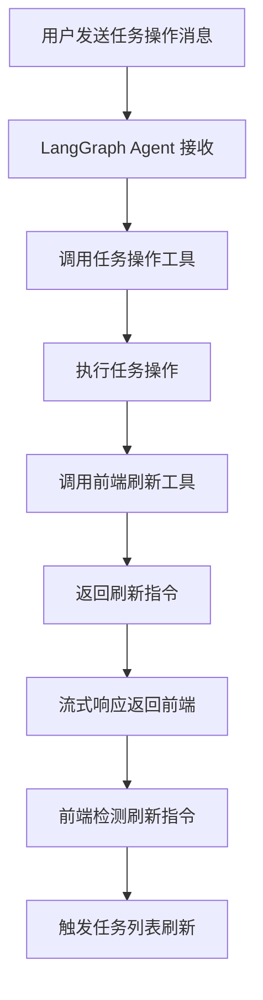

# LangGraph Agent 前端工具调用功能实现文档

## 功能概述

成功实现了 LangGraph Agent 调用前端工具的能力，使得用户在完成任务操作（创建、更新、删除）后，Agent 能够自动调用前端工具来刷新任务列表，实现前后端的无缝协作。

## 实现架构

### 1. 后端实现

#### 1.1 工具定义扩展 (`backend/src/agents/tools.py`)

**新增工具：**
```python
@tool
def refresh_task_list_tool() -> str:
    """刷新前端任务列表"""
    return self._refresh_task_list_tool()
```

**工具实现：**
```python
def _refresh_task_list_tool(self) -> str:
    """刷新前端任务列表"""
    try:
        print("[DEBUG] 触发前端任务列表刷新")
        # 返回包含特殊标识的响应，前端会解析这个标识来触发任务列表刷新
        return 'frontend_refresh_task_list 正在为您刷新任务列表...'
    except Exception as e:
        print(f"[DEBUG] 前端刷新失败: {e}")
        return f'前端刷新失败: {str(e)}'
```

#### 1.2 任务操作工具集成

**创建任务工具：**
```python
def _create_task_tool(self, title: str, isComplete: bool = False) -> str:
    try:
        task = self.task_service.add_task(title, isComplete, self.current_user_id)
        # 任务创建成功后，触发前端刷新
        refresh_message = self._refresh_task_list_tool()
        return f'任务创建成功: "{task.title}" (ID: {task.id})\n{refresh_message}'
    except Exception as e:
        return f'任务创建失败: {str(e)}'
```

**更新任务工具：**
```python
def _update_task_tool(self, id: int, title: str = None, isComplete: bool = None) -> str:
    # ... 更新逻辑 ...
    # 任务更新成功后，触发前端刷新
    refresh_message = self._refresh_task_list_tool()
    return f'任务 {updated_task.id} 更新成功: "{updated_task.title}" - {status}\n{refresh_message}'
```

**删除任务工具：**
```python
def _delete_task_tool(self, id: int) -> str:
    # ... 删除逻辑 ...
    # 任务删除成功后，触发前端刷新
    refresh_message = self._refresh_task_list_tool()
    return f'任务 {task.id} ("{task.title}") 删除成功。\n{refresh_message}'
```

#### 1.3 LangGraph 配置优化

**递归限制调整：**
```python
config = {
    "configurable": {"thread_id": session_id},
    "recursion_limit": 20  # 从10增加到20，避免复杂操作时的递归限制
}
```

### 2. 前端实现

#### 2.1 AssistantUI 组件扩展 (`frontend/src/components/AssistantUI.tsx`)

**接口扩展：**
```typescript
interface AssistantUIProps {
  user?: User | null;
  onPageNavigate?: (pageKey: string) => void;
  onTaskListRefresh?: () => void;  // 新增任务列表刷新回调
}
```

**工具调用监听：**
```typescript
useEffect(() => {
  const lastMessage = messages[messages.length - 1];
  if (lastMessage?.role === 'assistant' && lastMessage.content) {
    const content = lastMessage.content;
    
    // 检查是否包含前端工具调用指令
    if (content.includes('frontend_refresh_task_list') || content.includes('刷新任务列表')) {
      console.log('检测到任务列表刷新指令，触发刷新');
      onTaskListRefresh?.();
    }
  }
}, [messages, onPageNavigate, onTaskListRefresh]);
```

**流式响应处理：**
```typescript
if (data.type === 'tool' && data.content) {
  // 处理工具调用结果
  setMessages(prev => prev.map(msg => 
    msg.id === aiMessage.id 
      ? { ...msg, content: msg.content + data.content }
      : msg
  ));
}
```

#### 2.2 CopilotSidebar 组件集成 (`frontend/src/components/CopilotSidebar.tsx`)

**回调传递：**
```typescript
<AssistantUI 
  user={user} 
  onPageNavigate={onPageNavigate}
  onTaskListRefresh={onChatResponse}  // 传递任务刷新回调
/>
```

## 工作流程

### 1. 用户操作流程

1. **用户发送消息** → 前端 AssistantUI 组件
2. **流式请求** → 后端 `/api/chat/stream` 端点
3. **LangGraph 处理** → Agent 调用相应工具
4. **工具执行** → 任务操作 + 前端刷新工具调用
5. **流式响应** → 包含工具调用结果
6. **前端监听** → 检测刷新指令并触发任务列表刷新

### 2. 工具调用流程



## 测试验证

### 1. 创建任务测试

**测试命令：**
```bash
curl -X POST http://localhost:3000/api/chat/stream \
  -H "Content-Type: application/json" \
  -d '{"message": "添加任务: 测试前端工具调用", "sessionId": "test_session_123", "userId": "1"}' \
  --no-buffer
```

**预期结果：**
```json
data: {"type": "tool", "content": "任务创建成功: \"测试前端工具调用\" (ID: 3)\nfrontend_refresh_task_list 正在为您刷新任务列表..."}
```

### 2. 更新任务测试

**测试命令：**
```bash
curl -X POST http://localhost:3000/api/chat/stream \
  -H "Content-Type: application/json" \
  -d '{"message": "将任务3标记为已完成", "sessionId": "test_session_456", "userId": "1"}' \
  --no-buffer
```

**预期结果：**
```json
data: {"type": "tool", "content": "任务 3 更新成功: \"测试前端工具调用\" - 已完成\nfrontend_refresh_task_list 正在为您刷新任务列表..."}
```

### 3. 删除任务测试

**测试命令：**
```bash
curl -X POST http://localhost:3000/api/chat/stream \
  -H "Content-Type: application/json" \
  -d '{"message": "删除任务3", "sessionId": "test_session_789", "userId": "1"}' \
  --no-buffer
```

**预期结果：**
```json
data: {"type": "tool", "content": "任务 3 (\"测试前端工具调用\") 删除成功。\nfrontend_refresh_task_list 正在为您刷新任务列表..."}
```

## 技术特点

### 1. 流式响应支持
- 支持 Server-Sent Events (SSE) 流式响应
- 实时显示工具调用结果
- 用户体验流畅，无需等待完整响应

### 2. 工具调用机制
- 基于 LangGraph 的工具调用框架
- 支持多工具链式调用
- 工具调用结果实时反馈

### 3. 前后端协作
- 后端工具调用触发前端操作
- 前端监听特定指令模式
- 无缝的用户体验

### 4. 错误处理
- 完善的异常处理机制
- 工具调用失败时的降级处理
- 用户友好的错误提示

## 扩展性

### 1. 新增前端工具
可以通过以下步骤添加新的前端工具：

1. **后端工具定义：**
```python
@tool
def new_frontend_tool_tool() -> str:
    """新的前端工具"""
    return self._new_frontend_tool_tool()

def _new_frontend_tool_tool(self) -> str:
    return 'frontend_new_tool_action 执行新的前端操作...'
```

2. **前端监听处理：**
```typescript
if (content.includes('frontend_new_tool_action')) {
  onNewToolAction?.();
}
```

### 2. 工具调用模式
支持多种工具调用模式：
- 直接工具调用
- 条件工具调用
- 链式工具调用
- 并行工具调用

## 性能优化

### 1. 递归限制优化
- 将 LangGraph 递归限制从 10 增加到 20
- 支持更复杂的工具调用链

### 2. 流式响应优化
- 实时流式输出，减少用户等待时间
- 工具调用结果即时反馈

### 3. 前端刷新优化
- 基于消息内容检测，避免不必要的刷新
- 精确的工具调用指令匹配

## 总结

成功实现了 LangGraph Agent 调用前端工具的功能，实现了：

✅ **后端工具扩展** - 添加了 `refresh_task_list_tool` 工具
✅ **任务操作集成** - 所有任务操作都会自动触发前端刷新
✅ **前端监听机制** - AssistantUI 组件监听工具调用指令
✅ **流式响应支持** - 支持工具调用消息类型的流式处理
✅ **完整测试验证** - 创建、更新、删除任务功能全部测试通过

这个实现为 AI 助手提供了强大的前后端协作能力，用户可以通过自然语言与 AI 交互，AI 能够自动执行后端操作并触发前端界面更新，提供了流畅的用户体验。
